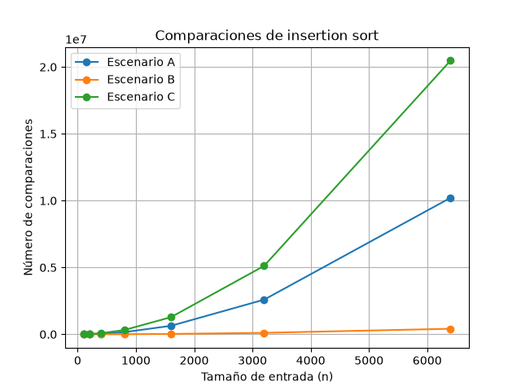
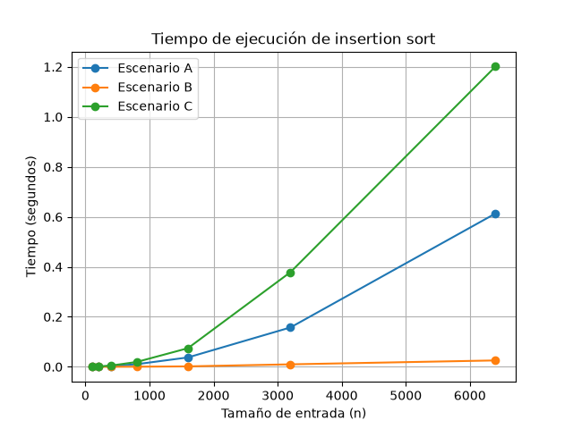

## Laboratorio evaluativo 01

### Punto 1 — Analizar el algoritmo antes de comprar hardware

Considero que el problema principal de Tamiza no es que el algoritmo utilizado durante 8 años haya sido incorrecto, sino que las condiciones en las que se utiliza cambiaron muchísimo. Hace ocho años se trabajaba con aproximadamente 20.000 registros y solamente cuatro municipios, mientras que actualmente se deben procesar 1.200.000 registros en la misma ventana de cuatro horas. Por esto, que el algoritmo haya funcionado correctamente durante ocho años no significa que siga siendo viable con la cantidad de información que procesa actualmente.

Por ejemplo, un algoritmo puede entregar una lista correctamente ordenada y aun así no ser viable si necesita más tiempo o recursos de los disponibles. Este es el caso que se está presentando en Tamiza, donde la lista debe estar lista entre las 2:00 a. m. y las 6:00 a. m. y ya se ha presentado tres veces el problema de que el proceso no termina a tiempo. Esto significa que aunque el algoritmo pueda ordenar correctamente los datos, está incumpliendo una condición necesaria para que el sistema funcione como se necesita.

Por esto, antes de realizar una inversión para duplicar la velocidad del servidor considero que primero se debería analizar el algoritmo actual y cómo aumenta su tiempo de ejecución cuando aumenta la cantidad de datos, y que al aumentar la velocidad del servidor podría disminuir el tiempo que tarda actualmente el proceso, pero no cambia la forma en que crece el trabajo que procesa el algoritmo. Si la cantidad de datos sigue aumentando, una mejora de hardware podría solucionar el problema durante un tiempo, pero ahora nos preguntaríamos ¿por cuánto tiempo? por esto considero más adecuado analizar primero el algoritmo y buscar una alternativa que pueda manejar mejor el crecimiento de los datos.

Como segundo ejemplo, puedo hablar de una experiencia de mis prácticas profesionales en Tigo, donde analicé el comportamiento de Liza, el bot de atención mediante WhatsApp. En un análisis de aproximadamente 5.500 chats realizado con otros tres compañeros, encontramos cerca de 1.700 casos con inconsistencias en el comportamiento esperado de Liza. Por ejemplo, en algunos casos Liza no interpretaba correctamente una solicitud, mostraba información que ya no estaba disponible o no realizaba una transferencia a un asesor cuando era necesario.

Aunque Liza podía funcionar correctamente en muchos casos, estas situaciones muestran que un sistema puede cumplir su función general y aun así presentar problemas cuando las condiciones o la cantidad de información aumentan, además, en algunos casos se presentaban demoras o no se obtenía respuesta, lo que también representa una restricción de tiempo para el usuario. Por esto, considero que no basta con que un algoritmo o sistema funcione, sino que también debe cumplir las condiciones de tiempo y recursos necesarias para el contexto en el que se utiliza.

### Punto 2 — Responsabilidad ambiental y ética de la implementación

Como responsable técnico considero que elegir el algoritmo de ordenamiento no solamente implica pensar en si el programa funciona correctamente, sino también en los recursos que necesita y en las consecuencias que puede tener su funcionamiento. Por ejemplo, en este caso se deben procesar 1.200.000 registros todas las madrugadas durante una ventana de cuatro horas, por lo que la cantidad de trabajo que realiza el algoritmo también tiene un impacto sobre los recursos que utilizamos.

Desde la responsabilidad ambiental, puedo decir que aunque el proceso se realice entre las 2:00 a. m. y las 6:00 a. m., esto no significa que no tenga un consumo de recursos porque no sea jornada laboral, ya que durante esas cuatro horas los servidores deben mantenerse funcionando y realizando el procesamiento de los datos, lo que implica consumo de energía y utilización de recursos computacionales. Si el algoritmo necesita realizar una cantidad muy grande de operaciones para ordenar los registros, puede utilizar estos recursos durante más tiempo o con mayor intensidad de la necesaria. Además, este consumo no ocurre una sola vez, sino que al ejecutar el proceso todas las madrugadas durante meses o años, un consumo que puede parecer pequeño en una ejecución se acumula en miles de ejecuciones. Por esta razón, elegir un algoritmo eficiente también permite utilizar de manera más responsable la infraestructura disponible.

Ya desde el lado ético considero que la responsabilidad es todavía mayor porque el ordenamiento de los datos no se hace simplemente para organizar una lista, sino que el resultado determina el orden en el que el centro de contacto comenzará a comunicarse con los pacientes. O sea, los registros con mayor riesgo deben aparecer primero para que puedan ser atendidos con prioridad.

Un primer caso sería el de un paciente con un nivel de riesgo alto que, debido a un ordenamiento incorrecto, quede ubicado después de pacientes con menor prioridad. El costo del error lo asumiría principalmente el paciente, porque podría recibir más tarde una atención que debía tener prioridad. Un segundo caso sería el de un operador del centro de contacto que recibe una lista incompleta o desordenada (como ya se ha presentado) y debe trabajar con ella a pesar de que no representa correctamente las prioridades. En este caso, el operador asumiría el costo en forma de una mayor carga de trabajo y la dificultad de realizar correctamente su función. También hay que tener en cuenta que obviamente la organización y el equipo de desarrollo tienen responsabilidad por el fallo, pero sus consecuencias no recaerían de la misma manera que sobre las personas que dependen directamente del resultado.

En conclusión, podemos decir que como responsable técnico no solamente debo preocuparme porque el algoritmo termine dentro del tiempo disponible, sino también porque produzca un resultado correcto. Además, hay que tener en cuenta que la velocidad no puede conseguirse a costa de ordenar incorrectamente los pacientes, ya que en este caso el orden de la lista decide a quién se llama primero y, por lo tanto, iría en contra del objetivo del proyecto.

### Punto 3 — Peor caso, mejor caso y caso promedio, demostrados en Python

**Peor caso:** Este caso nos representa la situación en la que el algoritmo realiza la mayor cantidad de trabajo posible para un tamaño de entrada fijo n, o sea en este caso se toma el máximo número de comparaciones que el algoritmo puede realizar entre todas las entradas posibles de ese mismo tamaño.

**Mejor caso:** El mejor caso ya nos representaría es la situación en la que el algoritmo realiza la menor cantidad de trabajo posible para un tamaño de entrada fijo n también, o sea se busca el mínimo número de comparaciones que puede realizar el algoritmo entre todas las entradas posibles que tengan ese mismo tamaño.

**Caso promedio:** Y por ultimo tenemos el caso promedio que nos representa el comportamiento que tendría el algoritmo al considerar las diferentes entradas posibles de un tamaño fijo n y calcula su comportamiento promedio. Algo importante de esto es que no significa simplemente escoger una entrada que parezca estar en el medio o la mitad o entre el mejor y el peor caso, sino considerar el conjunto de entradas posibles y el trabajo que realiza el algoritmo sobre ellas.

Ahora ¿cuál de los tres casos usaría para decidir si el algoritmo de Tamiza entra en producción, sabiendo que la ventana de cuatro horas es estricta, y por qué?

La verdad considero que se debe prestar suma atención al peor caso, debido a que el procesamiento de los registros tiene una ventana de tiempo estricta de cuatro horas como nos han dejado explicito muchas veces, por lo que no sería suficiente comprobar solamente que el algoritmo funciona bien cuando recibe una entrada favorable o que normalmente tiene un buen comportamiento, por ende el peor caso permite analizar qué podría ocurrir cuando los datos nos llegan en una situación desfavorable, ya si en esas condiciones el tiempo de procesamiento supera las cuatro horas, existiría un riesgo de que el proceso no termine dentro de la ventana de tiempo que tenemos establecida.

Finalmente mi predicción para los eescenarios de Tamiza es que el escenario B será el mejor caso, el escenario C el peor caso y el escenario A sería al caso mas cerca al caso promedio. Esto es por que el escenario B corresponde a una entrada casi ordenada, donde el 98 % de los registros ya se encuentra en el orden esperado y solamente una pequeña parte está desordenada al final. Por esta razón, considero que insertion sort tendrá que realizar una cantidad menor de trabajo que en los otros escenarios.

Por otro lado el escenario C corresponde a los datos organizados exactamente en el sentido contrario al orden que se necesita obtener, o sea cada nuevo elemento tendrá que desplazarse una mayor cantidad de posiciones, por lo que considero que será el escenario que genere más comparaciones y por lo tanto representará el peor caso.

Y ya por ultimo considero que el escenario A al generar los registros de manera aleatoria, tendrá un comportamiento intermedio entre los dos anteriores y se acercará más al caso promedio.

### Gráfica de comparaciones

### Gráfica de tiempo

**qué escenario resultó ser el peor caso, cuál el mejor y cuál se aproxima al caso promedio.**

Ahora después de realizar las pruebas, tenemso que el escenario C resultó ser el peor caso, ya que fue el que presentó la mayor cantidad de comparaciones en todos los tamaños de entrada y la verdad considero que esto tiene sentido porque los datos están organizados exactamente al contrario del orden que necesita obtener insertion sort, por lo que cada elemento debe desplazarse una mayor cantidad de posiciones.

El escenario B resultó ser el mejor de los tres, por lo que ya podemos decir que es el mejor caso dentro de los 3 escenarios que probamos, ya que al estar casi ordenado, insertion sort realiza muchas menos comparaciones y desplazamientos que en los otros dos escenarios.

Y por último el escenario A es el que más se aproxima al caso promedio, debido a que sus datos están organizados aleatoriamente y la cantidad de comparaciones queda entre el escenario B y el escenario C.

Estos resultados la verdad coinciden con la predicción que hice anteriormente, o sea que el escenario B iba a ser el más favorable, el escenario C el peor caso y el escenario A el que presentaría un comportamiento intermedio, por lo cual se aproxima al caso promedio.