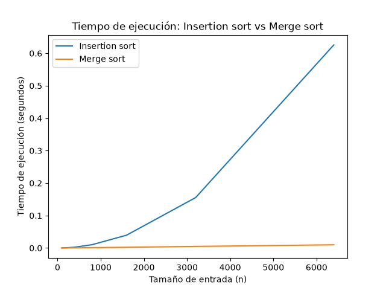

## Laboratorio evaluativo 01
**Nombre: Nathalie Gabriela Miranda Rejón**

### Instrucciones para reproducir el experimento 
Para reproducir el experimento se debe ingresar a la carpeta lab1-fundamentos-complejidad-recurrencias y crear el entorno virtual para instalar las dependencias necesarias.

Primero se crea el entorno virtual con:
```bash
python -m venv venv
```
En Windows, utilizando Git Bash, se activa el entorno virtual con:
```bash
source venv/Scripts/activate
```
Con el entorno virtual activo, se instalan las dependencias del proyecto mediante:
```bash
pip install -r requirements.txt
```
Para verificar que las dependencias se instalaron correctamente se puede utilizar:
```bash
pip list
```
Para ejecutar la Parte 3 y generar las mediciones y gráficas correspondientes se utiliza:
```bash
python parte3_casos.py
```

El código utilizado para esta parte se encuentra en [`parte3_casos.py`](parte3_casos.py). Los algoritmos utilizados se encuentran en [`algoritmos.py`](algoritmos.py) y los generadores de datos en [`datos.py`](datos.py).

Para ejecutar la Parte 4 y generar la gráfica de comparación de tiempos se utiliza:
```bash
python parte4_complejidad.py
```
El código utilizado para esta parte se encuentra en [`parte4_complejidad.py`](parte4_complejidad.py).

Las gráficas generadas por los experimentos se encuentran dentro de la carpeta graficas/.
La carpeta venv/ se encuentra incluida en .gitignore, por lo que el entorno virtual no se versiona en el repositorio. Si otra persona clona el proyecto, debe crear su propio entorno virtual y ejecutar nuevamente el paso de instalación de dependencias utilizando requirements.txt.

### Punto 1 — Analizar el algoritmo antes de comprar hardware
Considero que el problema principal de Tamiza no es que el algoritmo utilizado durante 8 años haya sido incorrecto, sino que las condiciones en las que se utiliza cambiaron muchísimo. Hace ocho años se trabajaba con aproximadamente 20.000 registros y solamente cuatro municipios, mientras que actualmente se deben procesar 1.200.000 registros en la misma ventana de cuatro horas. Por esto, que el algoritmo haya funcionado correctamente durante ocho años no significa que siga siendo viable con la cantidad de información actual.

Por ejemplo, un algoritmo puede entregar una lista correctamente ordenada y aun así no ser viable si necesita más tiempo o recursos de los disponibles. Este es el caso de Tamiza, donde la lista debe estar lista entre las 2:00 a. m. y las 6:00 a. m. y ya se ha presentado tres veces el problema de que el proceso no termina a tiempo. Aunque el algoritmo ordene correctamente los datos, está incumpliendo una condición necesaria para que el sistema funcione como se necesita.

Por esto, antes de realizar una inversión para duplicar la velocidad del servidor considero que primero se debería analizar el algoritmo actual y cómo aumenta su tiempo de ejecución cuando aumenta la cantidad de datos. Aumentar la velocidad del servidor podría disminuir el tiempo actual del proceso, pero no cambia la forma en que crece el trabajo del algoritmo. Si la cantidad de datos sigue aumentando, una mejora de hardware podría solucionar el problema durante un tiempo, pero ahora nos preguntaríamos ¿por cuánto tiempo? Por esto considero más adecuado analizar primero el algoritmo y buscar una alternativa que pueda manejar mejor el crecimiento de los datos.

Como segundo ejemplo, puedo hablar de una experiencia de mis prácticas profesionales en Tigo, donde analicé el comportamiento de Liza, el bot de atención mediante WhatsApp. En un análisis de aproximadamente 5.500 chats realizado con otros tres compañeros, revisamos conversaciones de clientes reales para identificar cómo estaba funcionando Liza, además a mí me correspondió documentar sus flujos, esto implicaba entrar directamente al bot y recorrer las diferentes opciones, por ejemplo, seleccionar una opción que llevaba a otras tres y continuar recorriendo cada camino para documentar qué respuesta daba Liza y cuándo podía transferir al usuario con un asesor.

Al hacer estas pruebas repetitivamente desde el celular, me pasó varias veces que Liza empezaba a presentar problemas después de recibir muchas peticiones dentro de una misma conversación. En algunos momentos dejaba de responder o rompía el flujo que normalmente debía seguir, por lo que tenía que volver a iniciar la conversación y repetir parte del proceso.

Para mí, este ejemplo muestra que no basta con que un sistema funcione correctamente en condiciones normales. También hay que tener en cuenta qué ocurre cuando aumenta la cantidad de peticiones o información que debe manejar. De manera similar, en Tamiza se debe analizar qué ocurre cuando aumenta la cantidad de registros, antes de asumir que aumentar la capacidad del servidor será suficiente.

### Punto 2 — Responsabilidad ambiental y ética de la implementación

Como responsable técnico considero que elegir el algoritmo de ordenamiento no solamente implica pensar en si el programa funciona correctamente, sino también en los recursos que necesita y en las consecuencias que puede tener su funcionamiento. Por ejemplo, en este caso se deben procesar 1.200.000 registros todas las madrugadas durante una ventana de cuatro horas, por lo que la cantidad de trabajo que realiza el algoritmo también tiene un impacto sobre los recursos que utilizamos.

Desde la responsabilidad ambiental, puedo decir que aunque el proceso se realice entre las 2:00 a. m. y las 6:00 a. m., esto no significa que no tenga un consumo de recursos porque no sea jornada laboral, ya que durante esas cuatro horas los servidores deben mantenerse funcionando y realizando el procesamiento de los datos, lo que implica consumo de energía y utilización de recursos computacionales. Si el algoritmo necesita realizar una cantidad muy grande de operaciones para ordenar los registros, puede utilizar estos recursos durante más tiempo o con mayor intensidad de la necesaria. Además, este consumo no ocurre una sola vez, sino que al ejecutar el proceso todas las madrugadas durante meses o años, un consumo que puede parecer pequeño en una ejecución se acumula en miles de ejecuciones. Por esta razón, elegir un algoritmo eficiente también permite utilizar de manera más responsable la infraestructura disponible.

Ya desde el lado ético considero que la responsabilidad es todavía mayor porque el ordenamiento de los datos no se hace simplemente para organizar una lista, sino que el resultado determina el orden en el que el centro de contacto comenzará a comunicarse con los pacientes. O sea, los registros con mayor riesgo deben aparecer primero para que puedan ser atendidos con prioridad.

Un primer caso sería el de un paciente con un nivel de riesgo alto que, debido a un ordenamiento incorrecto, quede ubicado después de pacientes con menor prioridad. El costo del error lo asumiría principalmente el paciente, porque podría recibir más tarde una atención que debía tener prioridad. Un segundo caso sería el de un operador del centro de contacto que recibe una lista incompleta o desordenada (como ya se ha presentado) y debe trabajar con ella a pesar de que no representa correctamente las prioridades. En este caso, el operador asumiría el costo en forma de una mayor carga de trabajo y la dificultad de realizar correctamente su función. También hay que tener en cuenta que obviamente la organización y el equipo de desarrollo tienen responsabilidad por el fallo, pero sus consecuencias no recaerían de la misma manera que sobre las personas que dependen directamente del resultado.

En conclusión, podemos decir que como responsable técnico no solamente debo preocuparme porque el algoritmo termine dentro del tiempo disponible, sino también porque produzca un resultado correcto. Además, hay que tener en cuenta que la velocidad no puede conseguirse a costa de ordenar incorrectamente los pacientes, ya que en este caso el orden de la lista decide a quién se llama primero y, por lo tanto, iría en contra del objetivo del proyecto.

### Punto 3 — Peor caso, mejor caso y caso promedio, demostrados en Python

**Código:** [`parte3_casos.py`](parte3_casos.py)

**Peor caso:** Este caso nos representa la situación en la que el algoritmo realiza la mayor cantidad de trabajo posible para un tamaño de entrada fijo n, o sea en este caso se toma el máximo número de comparaciones que el algoritmo puede realizar entre todas las entradas posibles de ese mismo tamaño.

**Mejor caso:** El mejor caso ya nos representaría es la situación en la que el algoritmo realiza la menor cantidad de trabajo posible para un tamaño de entrada fijo n también, o sea se busca el mínimo número de comparaciones que puede realizar el algoritmo entre todas las entradas posibles que tengan ese mismo tamaño.

**Caso promedio:** Y por último tenemos el caso promedio, que representa el comportamiento que tendría el algoritmo al considerar las diferentes entradas posibles de un tamaño fijo n y calcula su comportamiento promedio. Algo importante de esto es que no significa simplemente escoger una entrada que parezca estar en el medio o la mitad o entre el mejor y el peor caso, sino considerar las diferentes entradas posibles de tamaño fijo n y calcular el trabajo promedio, bajo una distribución determinada de esas entradas. 

Ahora ¿cuál de los tres casos usaría para decidir si el algoritmo de Tamiza entra en producción, sabiendo que la ventana de cuatro horas es estricta, y por qué?

La verdad considero que se debe prestar suma atención al peor caso, debido a que el procesamiento de los registros tiene una ventana de tiempo estricta de cuatro horas como nos han dejado explícito muchas veces, por lo que no sería suficiente comprobar solamente que el algoritmo funciona bien cuando recibe una entrada favorable o que normalmente tiene un buen comportamiento, por ende el peor caso permite analizar qué podría ocurrir cuando los datos nos llegan en una situación desfavorable, ya si en esas condiciones el tiempo de procesamiento supera las cuatro horas, existiría un riesgo de que el proceso no termine dentro de la ventana de tiempo que tenemos establecida.

Finalmente mi predicción para los escenarios de Tamiza es que el escenario B será el más favorable de los tres escenarios, el escenario C el peor caso y el escenario A sería al caso mas cerca al caso promedio. Esto es por que el escenario B corresponde a una entrada casi ordenada, donde el 98 % de los registros ya se encuentra en el orden esperado y solamente una pequeña parte está desordenada al final. Por esta razón, considero que insertion sort tendrá que realizar una cantidad menor de trabajo que en los otros escenarios.

Por otro lado el escenario C corresponde a los datos organizados exactamente en el sentido contrario al orden que se necesita obtener, o sea cada nuevo elemento tendrá que desplazarse una mayor cantidad de posiciones, por lo que considero que será el escenario que genere más comparaciones y por lo tanto representará el peor caso.

Y ya por último considero que el escenario A al generar los registros de manera aleatoria, tendrá un comportamiento intermedio entre los dos anteriores y se acercará más al caso promedio.

### Gráfica de comparaciones


### Gráfica de tiempo


**qué escenario resultó ser el peor caso, cuál el mejor y cuál se aproxima al caso promedio.**

Ahora después de realizar las pruebas, tenemos que el escenario C resultó ser el peor caso, ya que fue el que presentó la mayor cantidad de comparaciones en todos los tamaños de entrada y la verdad considero que esto tiene sentido porque los datos están organizados exactamente al contrario del orden que necesita obtener insertion sort, por lo que cada elemento debe desplazarse una mayor cantidad de posiciones.

El escenario B resultó ser el mejor de los tres, por lo que ya podemos decir que es el mejor caso dentro de los 3 escenarios que probamos, ya que al estar casi ordenado, insertion sort realiza muchas menos comparaciones y desplazamientos que en los otros dos escenarios.

Y por último el escenario A es el que más se aproxima al caso promedio, debido a que sus datos están organizados aleatoriamente y la cantidad de comparaciones queda entre el escenario B y el escenario C.

Estos resultados la verdad coinciden con la predicción que hice anteriormente, o sea que el escenario B iba a ser el más favorable, el escenario C el peor caso y el escenario A el que presentaría un comportamiento intermedio, por lo cual se aproxima al caso promedio.

### Punto 4 — Complejidad de merge sort e insertion sort: cálculo y validación

**Código:** [`parte4_complejidad.py`](parte4_complejidad.py)

### 4.1 — Cálculo teórico

#### - Merge sort

La recurrencia de merge sort es: `T(n)= 2T(n/2)+ Θ(n)`

Primero que todo, el término `(2T(n/2))` aparece porque el algoritmo divide el problema original en dos subproblemas, y cada uno de estos tiene la mitad de los elementos, o sea `(n/2)`. Luego estos dos subproblemas se resuelven de manera recursiva.

Y ya el término `Θ(n)` corresponderá al proceso de combinación, o sea que después de ordenar las dos mitades, merge sort debe mezclarlas para obtener una sola lista ordenada. En este proceso se recorren los elementos de las dos partes, por lo que el costo de combinar es lineal respecto al tamaño de la entrada.

El árbol de recursión se puede representar de la siguiente manera:

```bash
                     n
                    Θ(n) ← costo del nivel
                   /   \
                 n/2   n/2
              Θ(n/2) Θ(n/2)
                / \     / \
              n/4 n/4 n/4 n/4
                    ...
                    / \
                   1   1
```

En el primer nivel tenemos un problema de tamaño `n`, por lo que el costo es `Θ(n)`. Ya en el segundo nivel tenemos dos problemas de tamaño `(n/2)`: `2Θ(n/2)=Θ(n)`, y finalmente en el tercer nivel tenemos cuatro problemas de tamaño `(n/4)`: `4Θ(n/4)=Θ(n)`.

Por lo tanto, en cada nivel del árbol el costo total es `Θ(n)`.

La división continúa hasta que cada subproblema tiene un tamaño de 1. Como en cada nivel el tamaño se divide entre 2, el número de niveles sería aproximadamente `log₂ n`.

Entonces, si cada nivel tiene un costo de `Θ(n)` y existen `Θ(log n)` niveles, el costo total es:

`T(n)=Θ(n)·Θ(log n)= Θ(n log n)`

Por lo tanto, la complejidad de merge sort es: `Θ(n log n)`.

#### - Insertion sort

**Mejor caso:** El mejor caso ocurre cuando la lista ya se encuentra ordenada, por ejemplo:

```text
[1, 2, 3, 4, 5]
```

En este caso, el ciclo `for` procesa los elementos desde el segundo hasta el último, por lo que el cuerpo se ejecuta `n-1` veces. Por esta razón, las líneas `clave = lista[i]` y `j = i - 1` también se ejecutan `n-1` veces.

En cada iteración del `for`, el `while` realiza solamente una comparación entre elementos:

```python
if lista[j] > clave:
```

Como la lista ya está ordenada, esta comparación resulta falsa y se ejecuta el `break`. Por lo tanto, se realizan `n-1` comparaciones en total. Las líneas que desplazan elementos no se ejecutan en este caso.

La línea `lista[j + 1] = clave` también se ejecuta `n-1` veces.

Por lo tanto, el trabajo crece de forma lineal con respecto a `n` y la complejidad del mejor caso sería de `Θ(n)`.

**Peor caso:** El peor caso ocurre cuando la lista está organizada exactamente en el orden contrario al que se necesita obtener, por ejemplo:

```text
[5, 4, 3, 2, 1]
```

En este caso, cada nuevo elemento debe compararse con todos los elementos que ya se encuentran a su izquierda y desplazarlos una posición. Las comparaciones realizadas serían `1 + 2 + 3 + ... + (n-1)` y la suma de estos valores es de `n(n-1)/2`, que equivaldría a `(n²-n)/2`. Por lo tanto, el número de comparaciones crece cuadráticamente con `n`.

Para analizar el costo línea por línea podemos revisar cuántas veces se ejecuta cada instrucción en el peor caso. Primero, las líneas `lista = datos.copy()` y `comparaciones = 0` se ejecutan una sola vez, por lo que tienen un costo constante.

Luego comienza el ciclo `for`, que se ejecuta `n-1` veces, porque empieza desde el segundo elemento de la lista hasta el último. Por esta razón, las instrucciones:

```text
clave = lista[i]

j = i - 1
```

también se ejecutan `n-1` veces y tienen un costo lineal en conjunto.

En el peor caso, el `while` debe recorrer todos los elementos que se encuentran a la izquierda del elemento que se está insertando. Para el segundo elemento realiza 1 comparación, para el tercero realiza 2, para el cuarto 3 y así sucesivamente hasta llegar al último elemento, que realiza `n-1` comparaciones. Por lo tanto, las comparaciones entre elementos se pueden sumar como:

```text
1 + 2 + 3 + ... + (n-1) = n(n-1)/2
```

La instrucción:

```text
comparaciones += 1
```

se ejecuta una vez por cada comparación entre elementos, por lo que también se ejecuta `n(n-1)/2` veces en el peor caso.

De la misma manera, las instrucciones:

```text
lista[j + 1] = lista[j]

j -= 1
```

se ejecutan cada vez que un elemento debe desplazarse. En el peor caso, estos desplazamientos también se realizan `n(n-1)/2` veces.

Finalmente, la instrucción:

```text
lista[j + 1] = clave
```

se ejecuta una vez por cada iteración del `for`, es decir, `n-1` veces, y el `return` se ejecuta una sola vez.

Para expresar el costo total, podemos representar cada instrucción con una constante que representa el costo de ejecutarla. En el peor caso, la suma puede expresarse de la siguiente manera:

```text
T(n) = c₁ + c₂ + c₃(n-1) + c₄(n-1) + c₅(n-1)
       + c₆[n(n-1)/2] + c₇[n(n-1)/2]
       + c₈[n(n-1)/2] + c₉(n-1) + c₁₀
```

Los términos que dependen de `n(n-1)/2` corresponden a las operaciones que se realizan dentro del `while`, como las comparaciones entre elementos, los desplazamientos y la actualización de `j`. Los demás términos corresponden a instrucciones que se ejecutan una cantidad constante de veces o `n-1` veces.

Al desarrollar los términos cuadráticos, la expresión puede escribirse de forma general como:

```text
T(n) = an² + bn + c
```

donde `a`, `b` y `c` son constantes. Cuando `n` aumenta, el término que domina el crecimiento es `an²`, por lo que podemos concluir que:

```text
T(n) = Θ(n²)
```

Esto demuestra mediante el conteo de las instrucciones que el peor caso de insertion sort tiene un crecimiento cuadrático.

**Caso promedio:** El caso promedio ocurre cuando la lista tiene una distribución desordenada pero no necesariamente está organizada completamente al contrario. En este caso, algunos elementos ya estarán en una posición adecuada y otros tendrán que desplazarse para colocar cada elemento en la posición que le corresponde dentro de la parte que ya está ordenada.

En este caso, cada elemento tendrá que compararse aproximadamente con la mitad de los elementos que ya se encuentran a su izquierda. Por esta razón, aunque el número de comparaciones es menor que en el peor caso, sigue creciendo de forma cuadrática a medida que aumenta `n`.

Por lo tanto, el caso promedio también tiene una complejidad de `Θ(n²)`.

| Algoritmo      | Mejor caso   | Caso promedio | Peor caso    |
| -------------- | ------------ | ------------- | ------------ |
| Insertion sort | `Θ(n)`       | `Θ(n²)`       | `Θ(n²)`      |
| Merge sort     | `Θ(n log n)` | `Θ(n log n)`  | `Θ(n log n)` |

### 4.2 — Validación experimental



Al comparar los tiempos obtenidos en la gráfica se puede observar que merge sort presenta un crecimiento mucho menor que insertion sort a medida que aumenta el tamaño de la entrada. Para tamaños pequeños la diferencia no es tan grande, pero al aumentar n esta diferencia se vuelve mucho más evidente.

La forma en que crecen las curvas también coincide con lo planteé en el cálculo teórico. En insertion sort, al duplicar aproximadamente el tamaño de la entrada, el tiempo aumenta cerca de cuatro veces, lo cual es consistente con su comportamiento cuadrático en el caso promedio, Θ(n²). En cambio merge sort presenta un crecimiento mucho más moderado, consistente con su complejidad Θ(n log n).

**cuál de los dos algoritmos es mejor para Tamiza y por qué**

Para el escenario de Tamiza considero que merge sort sería la mejor opción, ya que nos presenta un comportamiento más favorable cuando aumenta el número de registros, y esta conclusión coincide con la que plentee en el punto 4.1, donde se planteaba que merge sort tuviera un crecimiento menor que insertion sort para entradas grandes.

Las pequeñas diferencias que pueden observarse en los tamaños más pequeños no cambian esta tendencia, ya que en esos casos los tiempos son muy reducidos y la diferencia entre ambos algoritmos puede verse afectada en mayor medida por el costo de las operaciones adicionales y por las condiciones de ejecución del equipo.

### 4.3 — Concepto técnico a la Secretaría de Salud

Para el escenario actual de Tamiza recomiendo utilizar merge sort como algoritmo de ordenamiento. El criterio principal para tomar esta decisión es el crecimiento del tiempo de ejecución frente al aumento de los registros y no solamente el comportamiento de una entrada específica. Esto es importante porque el canal de entrada puede cambiar sin aviso y el equipo no quiere mantener tres implementaciones diferentes. En nuestras pruebas, merge sort presentó un crecimiento mucho menor del tiempo y no depende de que los datos lleguen casi ordenados como ocurre con el escenario B de insertion sort.

Los resultados obtenidos respaldan esta decisión. Con n = 6400, en el escenario A, insertion sort tardó aproximadamente 0.6596 segundos, mientras que merge sort tardó 0.00997 segundos, como se observa en la gráfica de validación experimental. Esto significa que para ese tamaño merge sort tardó aproximadamente 66 veces menos. Además, en las mediciones de insertion sort, al duplicar el tamaño de entrada en los valores más grandes, el tiempo aumentó aproximadamente cuatro veces, comportamiento consistente con Θ(n²). En cambio, merge sort presentó un crecimiento mucho más moderado, consistente con Θ(n log n).

Para estimar el comportamiento con los 1.200.000 registros actuales, utilizo los datos medidos y el crecimiento observado. Para insertion sort, tomando como referencia el escenario A con n = 6400, la extrapolación cuadrática sería:

T(1.200.000) ≈ 0.6596 × (1.200.000 / 6400)² ≈ 6.44 horas

Para merge sort, utilizando la medición de 0.00997 segundos en n = 6400 y su crecimiento n log n:

T(1.200.000) ≈ 0.00997 × (1.200.000 log₂(1.200.000)) / (6400 log₂(6400)) ≈ 2.99 segundos

Estos valores son una estimación mediante extrapolación, no una medición directa con 1.200.000 registros, por lo que el tiempo real puede variar según la infraestructura y las condiciones de ejecución.

Respecto a la propuesta de comprar un servidor con el doble de velocidad, no considero que esta medida por sí sola garantice solucionar el problema. Para analizar una ventana estricta de cuatro horas debemos tener en cuenta el peor caso. En el escenario C, que fue el peor de nuestras pruebas, insertion sort tardó 1.2273 segundos con n = 6400. Extrapolando ese comportamiento cuadrático a 1.200.000 registros, el tiempo estimado sería de aproximadamente 11.98 horas. Incluso suponiendo idealmente que un servidor con el doble de velocidad redujera este tiempo a la mitad, serían aproximadamente 5.99 horas, todavía por encima de la ventana disponible. Esto muestra que aumentar el hardware puede reducir el tiempo, pero no cambia el crecimiento cuadrático del algoritmo.

Finalmente, debe considerarse que merge sort utiliza memoria adicional durante la división y combinación de las listas. Esta utilización debe validarse en la infraestructura real antes de pasar a producción. Sin embargo, considerando la ventana estricta, el cambio que puede presentar la entrada y los resultados medidos, recomiendo adoptar merge sort y realizar posteriormente una prueba de carga con una cantidad de registros cercana a la de producción.